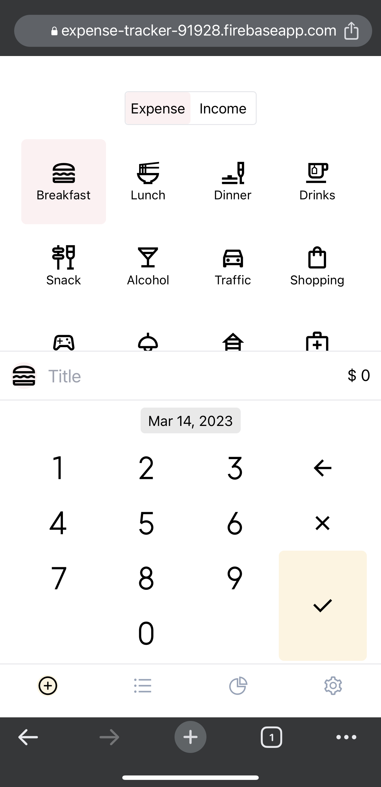

<p align="center">
  
</p>

## Features

- No UI component library[^1]
- Optimized for mobile devices
- Dark theme
- Typescript / React / Redux / Nextjs
- Firebase: auth / firestore

[^1]: expect icon and chart

## Getting Started

First fill env variables for `firebaseConfig`.

`.env.local`

```
NEXT_PUBLIC_FIREBASE_PUBLIC_API_KEY=
NEXT_PUBLIC_FIREBASE_AUTH_DOMAIN=
NEXT_PUBLIC_FIREBASE_PROJECT_ID=
NEXT_PUBLIC_FIREBASE_STORAGE_BUCKET=
NEXT_PUBLIC_FIREBASE_MESSAGING_SENDER_ID=
NEXT_PUBLIC_FIREBASE_APP_ID=
NEXT_PUBLIC_FIREBASE_MEASUREMENT_ID=
```

Run the development server:

```bash
npm run dev
# or
yarn dev
# or
pnpm dev
```

Open [http://localhost:3000](http://localhost:3000) with your browser to see the result.

### Cloud Firestore Rules

```CEL
rules_version = '2';
service cloud.firestore {
  match /databases/{database}/documents {
    match /users/{userId}/{other=**} {
      allow read, write: if
          request.auth != null && request.auth.uid == userId;
    }
  }
}
```

## My Notes

1. [firebase doc](https://firebase.google.com/docs/web/setup?authuser=0)
2. [tutorial for firebase auth with nextjs](https://blog.logrocket.com/implementing-authentication-in-next-js-with-firebase/)
3. [git ignorecase](https://vercel.com/guides/how-do-i-resolve-a-module-not-found-error)
4. [firebase-tools issue](https://github.com/firebase/firebase-tools/issues/5369) - Solved by using version 11.18.0
5. [firebase nextjs](https://firebase.google.com/docs/hosting/nextjs)
6. mobile browser issues caused by keyboard
   1. [Page jump up when using keyboard](https://stackoverflow.com/questions/8860914/on-android-browser-the-whole-page-jumps-up-and-down-when-typing-inside-a-textbo) - z-index?
   2. [Element move on scroll](https://stackoverflow.com/questions/44679794/position-fixed-on-chrome-mobile-causing-element-to-move-on-scroll-up-down) - viewport
   3. [Mobile keyboard pushes up content](https://stackoverflow.com/questions/43702979/mobile-keyboard-pushes-up-content-because-of-an-absolutely-positioned-drawer) - parent position relative
7. [touch and mouse together](https://medium.com/frochu/touch-and-mouse-together-76fb69114c04) - click is delayed 0.3s
8. [-webkit-tap-highlight-color](https://developer.mozilla.org/en-US/docs/Web/CSS/-webkit-tap-highlight-color#specifications)
9. [nextjs render twice](https://github.com/vercel/next.js/issues/35822) - component render twice because strict mode
10. [router prefetch](https://nextjs.org/docs/api-reference/next/router#routerprefetch)
11. [get img 403](https://stackoverflow.com/questions/56242788/http-403-on-images-loaded-from-googleusercontent-com) - referrerPolicy
